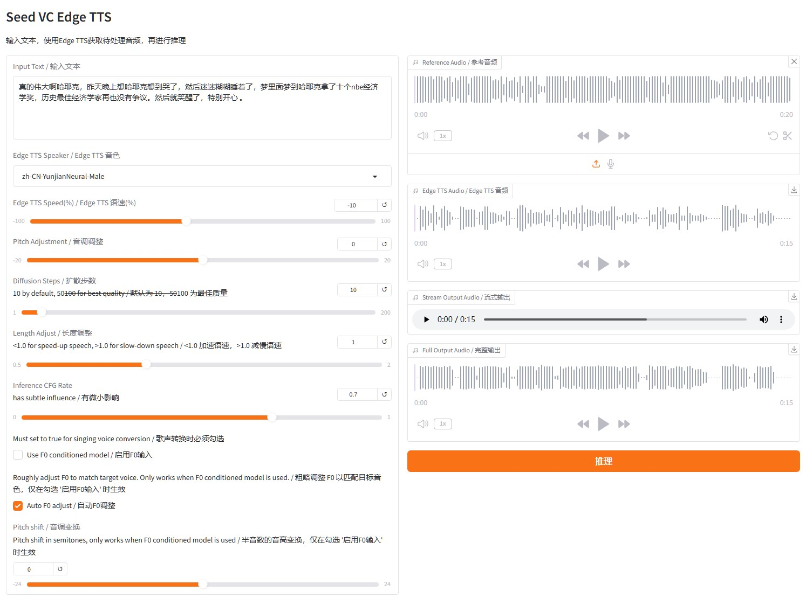

# seed-vc-edge-tts
seed vc 使用 edge tts 生成音频再进行推理，实现 seed vc 的文本转语音功能

基于`app.py`修改而来

## 使用方法
下载`seed_vc_edge_tts.py`到 seed vc 项目根目录，

安装`requirements.txt`所需依赖，

运行，

然后在浏览器中打开 `http://localhost:7860/` 使用 Web 界面

## 你需要关注以下修改
edge tts 新版本需要网络代理才能访问，所以需要指定网络代理
```python
edge_proxy = "输入你的代理地址"

例：edge_proxy = "http://192.168.0.1:7890"
```
```python
edge_tts.Communicate(tts_text, "-".join(tts_choice.split("-")[:-1]), rate=speed_str, pitch=pitch_str, proxy=edge_proxy)
```
## 效果
